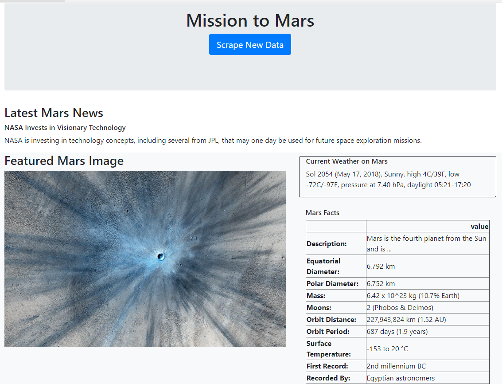
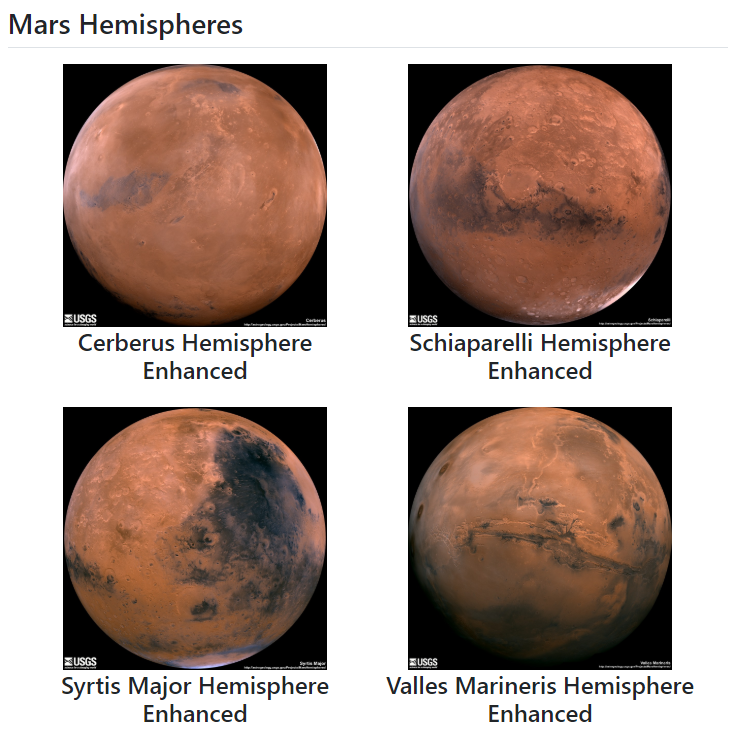

# Mars Web Scraping

This project involves compiling multiple sources of Mars data, and displaying it onto one web page. 

Webscraping is done using BeautifulSoup. Links to each website is shown below
- [NASA Mars News Site](https://mars.nasa.gov/news/)
- [JPL's featured space image](https://www.jpl.nasa.gov/spaceimages/?search=&category=Mars)
- [Mars weather twitter account](https://twitter.com/marswxreport?lang=en)
- [Mark Facts webpage](http://space-facts.com/mars/)

Then, mars hemisphers photos is taken from the USGS API

All of this data is stored into a MongoDB and then pulled back out to display on the template index.html. Photos of the website are shown below.

